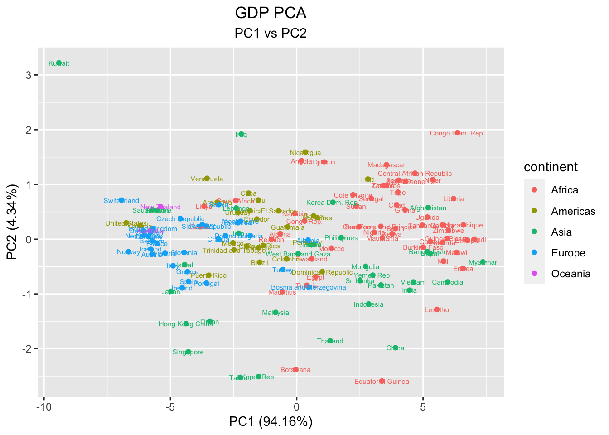
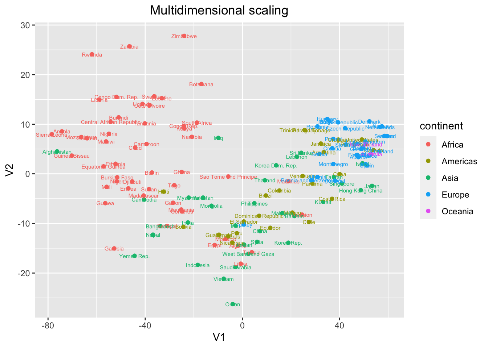
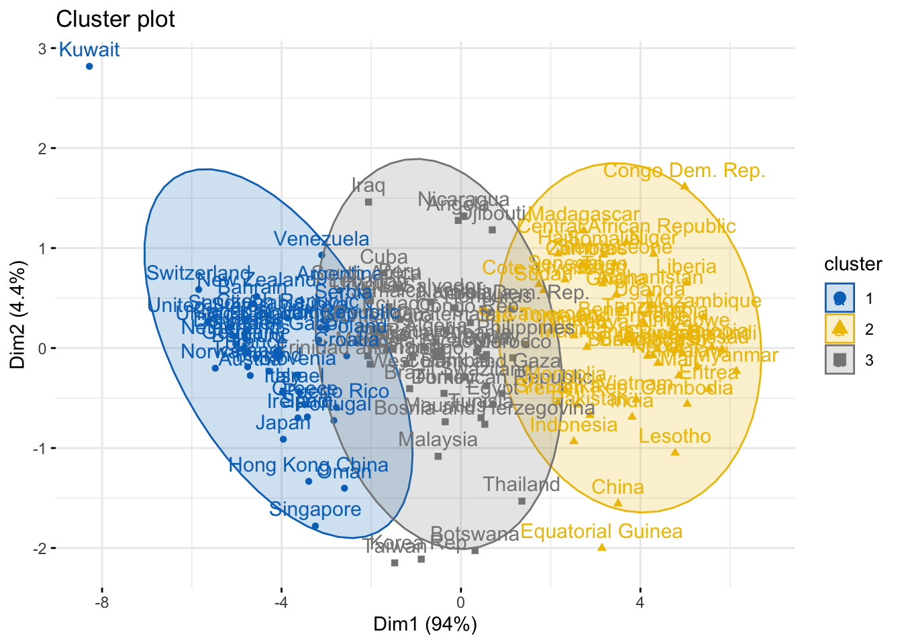
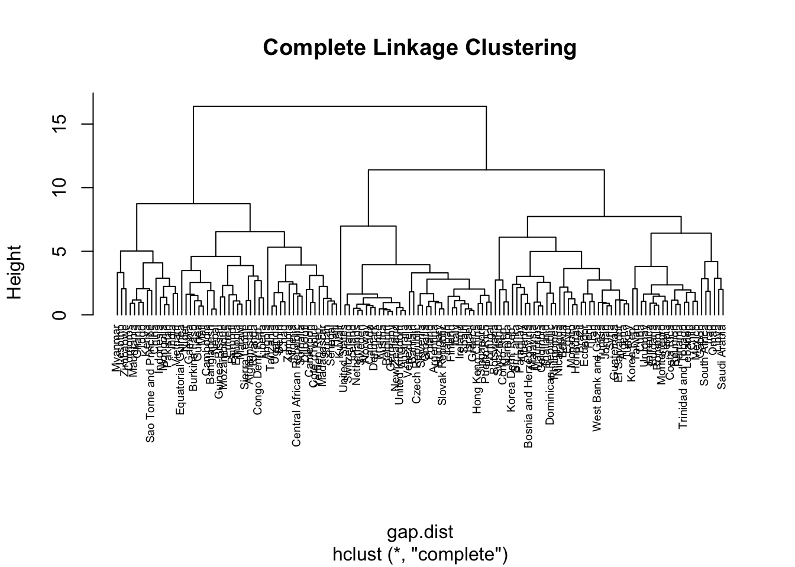
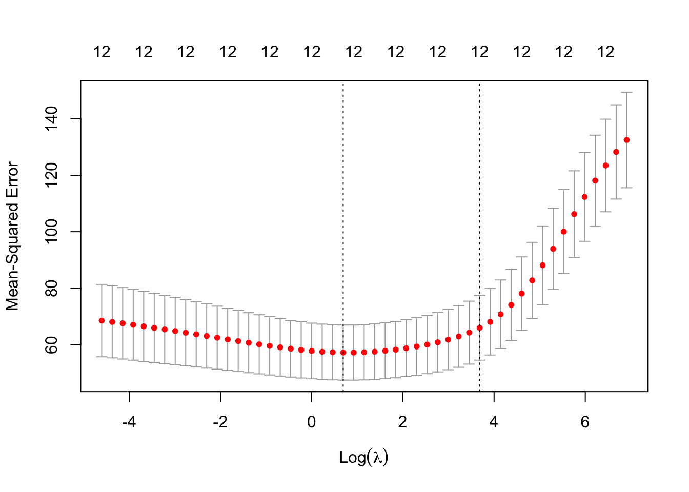
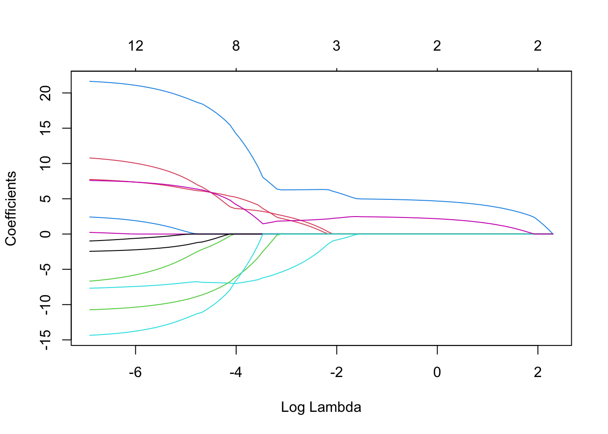

# GDP_Life_Expectancy
GDP and Life Expectancy Analysis - 

This project tends to analyze the relationship between GDP and Life Expectancy. The data contains the GDP per capita, and the life expectancy for 142 different countries from 1952 to 2007. This data is from gapminder.org. The data is available in the data folder. The data is cleaned and analyzed using R. The analysis is done using the R packages. The analysis is done using the following steps:

1. Data Preprocessing
2. Exploratory Data Analysis
3. Principal Component Analysis
4. Multidimensional Scaling (MDS)
5. Hypothesis Testing
6. Linear Discriminant Analysis (LDA)
7. K-Means Clustering
8. Hierarchical Clustering
9. Linear Regression
10. Conclusion

In this project, we have analyzed the Gapminder dataset. We have found that the life expectancy has increased over the years. We have also found that the GDP has increased over the years. We have found that the life expectancy is correlated with the GDP. We have also found that the life expectancy is correlated with the GDP per capita.